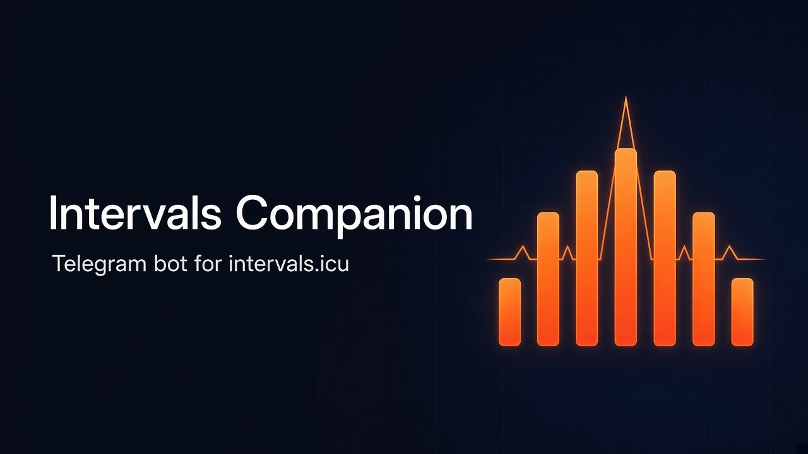

<p align="center">
  
</p>

# Intervals Companion Bot

Telegram-бот-компаньон для [intervals.icu](https://intervals.icu): план тренировок, форма, анонсы и отчёты после активности.

Бот: [@intervals_companion_bot](https://t.me/intervals_companion_bot)

Подробный план — в [plan.md](plan.md).

## Стек

- **bot/** — aiogram 3
- **backend/** — Django 5 + DRF + Admin
- **Celery + Beat** — синхронизация с intervals.icu и уведомления
- PostgreSQL, Redis, Docker Compose

## Быстрый старт

```bash
cp .env.example .env
# Заполните TELEGRAM_BOT_TOKEN (токен от @BotFather)

docker compose up --build
```

Сервисы:

| Сервис | URL / роль |
|--------|------------|
| backend | http://localhost:8000 |
| admin | http://localhost:8000/admin/ |
| bot | long polling |
| celery_worker / celery_beat | фоновые задачи |

Создать админа:

```bash
docker compose exec backend python manage.py createsuperuser
```

## Локальная разработка без Docker

```bash
python3 -m venv .venv
source .venv/bin/activate
pip install -r backend/requirements.txt -r bot/requirements.txt
cp .env.example .env
# Для локального запуска можно использовать sqlite (по умолчанию, если нет DATABASE_URL)

cd backend && python manage.py migrate
celery -A config worker -l info &
celery -A config beat -l info &
python manage.py runserver

# в другом терминале
cd bot && BACKEND_URL=http://127.0.0.1:8000 python main.py
```

## Команды бота

- `/start` — подключение и статус
- `/plan` — сегодня / завтра / ближайшие события
- `/reports` — последние тренировки с графиками
- `/form` — CTL, ATL, Form, вес, VO2max + график за 30 дней
- `/zones` — распределение зон Z1–Z5 за неделю (факт vs план)
- `/analyze` — принудительный AI-анализ дня или недели (нужна подписка)
- `/settings` — анонсы, отчёты, AI-анализ (время по умолчанию 21:30), timezone
- `/disconnect` — удалить API-ключ
- `/help` — справка

## Тесты

```bash
cd backend
pytest
```

## Безопасность

- API-ключи intervals.icu хранятся зашифрованными (Fernet)
- Сообщение с ключом в Telegram удаляется после приёма
- Внутренний API бота защищён заголовком `X-Internal-Token`

## AI-анализ (DeepSeek)

При активной подписке бот присылает **дневной** AI-анализ в локальное `analysis_time` (по умолчанию 21:30) и **недельный** по воскресеньям в то же время (текст + графики CTL/ATL/TSB и зон). Учитываются план, тренировки, wellness (HRV, resting HR, сон, вес), CTL/ATL/Form и личные рекорды по power/HR curves. В отчёте сразу после тренировки бот также поздравляет с новыми лучшими усилиями (например 5-минутка по мощности).

Принудительно: `/analyze` в боте или actions в Django Admin (`AiPeriodReport`: regenerate/resend).

Нужны переменные:

- `DEEPSEEK_API_KEY` — ключ API
- `DEEPSEEK_BASE_URL` — по умолчанию `https://api.deepseek.com`
- `DEEPSEEK_MODEL` — по умолчанию `deepseek-chat`
- `DEEPSEEK_MAX_TOKENS` — по умолчанию `4096` (нужно больше для reasoning-моделей)
- `DEEPSEEK_TIMEOUT` — таймаут ответа в секундах, по умолчанию `180`

Без ключа или без подписки AI-анализ не генерируется; обычные отчёты по тренировкам работают как раньше.
