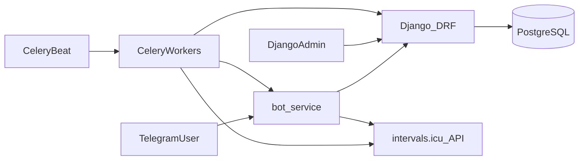

# План реализации Intervals Companion Bot

Проект реализован как Python monorepo. Стек: **Python monorepo**, Django + DRF + Admin, aiogram 3, Celery/Beat + Redis, PostgreSQL, Docker Compose. Auth к intervals.icu — **персональный API-ключ** (Basic Auth `API_KEY` / ключ). Детект завершённых тренировок — **polling** через Celery (webhooks требуют OAuth-приложение; на первом этапе не используем).

Статус: реализовано в репозитории. Запуск — см. [README.md](README.md).

---

## 1. Цели продукта

Telegram-бот-компаньон для [intervals.icu](https://intervals.icu):

| Функция | Описание |
|--------|----------|
| Подключение аккаунта | Пользователь получает инструкцию и вводит API-ключ |
| План и события | Ближайшие события календаря, тренировки сегодня/завтра |
| Форма | Fitness (CTL), Fatigue (ATL), Form (TSB), вес, VO2max |
| Анонс тренировки | По настраиваемому расписанию (timezone пользователя) |
| Отчёт после тренировки | Текст + картинка интервалов + % соответствия плану + метрики |

---

## 2. Высокоуровневая архитектура



**Компоненты:**

1. **`bot/`** — aiogram 3: UX, команды, FSM ввода ключа/настроек; вызывает внутренний API бэкенда; отправляет сообщения по запросу воркеров (через очередь/HTTP callback).
2. **`backend/`** — Django: модели, DRF API, Admin, бизнес-логика, клиент intervals.icu, Celery-задачи.
3. **Инфра** — PostgreSQL, Redis (broker + cache), Docker Compose.

**Принцип разделения:** бот не пишет в БД напрямую; вся персистентность и вызовы ICU (кроме срочных read-through по команде) идут через backend.

---

## 3. Структура репозитория

```
intervals_companion_bot/
├── plan.md
├── README.md
├── docker-compose.yml
├── .env.example
├── .gitignore
├── pyproject.toml              # workspace / shared deps (опционально)
├── backend/
│   ├── manage.py
│   ├── config/                 # settings, urls, celery.py, wsgi
│   ├── apps/
│   │   ├── users/              # TelegramUser, настройки, шифрование ключа
│   │   ├── intervals/          # клиент ICU, sync, кэш плана/активностей/формы
│   │   ├── notifications/      # анонсы, отчёты, статусы доставки
│   │   └── charts/             # генерация PNG интервалов
│   └── requirements.txt
├── bot/
│   ├── main.py
│   ├── handlers/               # start, connect, plan, form, settings
│   ├── keyboards/
│   ├── middlewares/
│   ├── api_client.py           # HTTP-клиент к Django
│   └── requirements.txt
└── docs/
    └── intervals_api.md        # краткая шпаргалка по эндпоинтам
```

---

## 4. Модель данных (Django)

### 4.1 `apps.users`

**`TelegramUser`**
- `telegram_id` (unique), `username`, `first_name`, `language_code`
- `timezone` (IANA, default `Europe/Moscow`)
- `is_active`, `created_at`, `updated_at`

**`IntervalsCredentials`**
- OneToOne → `TelegramUser`
- `api_key_encrypted` (Fernet / Django encrypted field)
- `athlete_id` (строка вида `i123456`, из профиля ICU)
- `is_valid`, `last_validated_at`, `last_error`

**`NotificationSettings`**
- OneToOne → `TelegramUser`
- `announce_enabled` (bool)
- `announce_time` (TimeField) — локальное время анонса
- `announce_days` — bitmask или JSON дней недели (по умолчанию все)
- `report_enabled` (bool)
- `morning_summary_enabled` (bool, опционально v2)

### 4.2 `apps.intervals`

**`AthleteSnapshot`** — последняя известная форма
- `fitness` (CTL), `fatigue` (ATL), `form` (TSB), `weight`, `vo2max`
- `as_of_date`, `raw_json`, `synced_at`

**`CalendarEventCache`**
- `external_id`, `category` (WORKOUT / RACE / NOTE / …)
- `name`, `type` (Ride/Run/…), `start_date_local`, `end_date_local`
- `icu_training_load`, `workout_doc` (JSON), `raw_json`
- `synced_at`

**`Activity`**
- `external_id` (id активности ICU)
- `name`, `type`, `start_date_local`, `moving_time`, `distance`
- метрики: `icu_training_load`, `icu_intensity`, `average_watts`, `weighted_average_watts`, `average_heartrate`, `max_heartrate`, `total_elevation_gain`, …
- `compliance` / `icu_joy` / поля соответствия плану (из ответа ICU, если есть)
- `matched_event_id` (FK nullable на кэш события)
- `intervals_json`, `report_sent_at`, `chart_path` (nullable)
- unique `(user, external_id)`

### 4.3 `apps.notifications`

**`NotificationLog`**
- `user`, `kind` (`announce` | `report` | `system`)
- `payload_ref` (activity_id / event_id)
- `status` (`pending` | `sent` | `failed`)
- `telegram_message_id`, `error`, `created_at`, `sent_at`
- уникальность: не слать повторный announce на тот же event+date; не слать повторный report на ту же activity

---

## 5. Интеграция с intervals.icu

Базовый URL: `https://intervals.icu/api/v1`  
Auth: Basic `username=API_KEY`, `password=<user_api_key>`  
Athlete path id: `0` или сохранённый `athlete_id`.

| Назначение | Метод |
|------------|--------|
| Валидация ключа / профиль | `GET /athlete/0` |
| События календаря | `GET /athlete/0/events?oldest=&newest=` (+ `resolve=true` для ватт/ЧСС) |
| Wellness / форма / вес | `GET /athlete/0/wellness?oldest=&newest=` |
| Fitness time series | `GET /athlete/0/fitness?oldest=&newest=` (дополнительно) |
| Активности | `GET /athlete/0/activities?oldest=&newest=` |
| Детали + интервалы | `GET /activity/{id}?intervals=true` |

**Клиент:** `apps.intervals.client.IntervalsClient` — `httpx`, таймауты, retry (429/5xx), логирование без утечки ключа.

**Шифрование ключей:** ключ в БД только в зашифрованном виде; в логах — маскирование.

**VO2max / вес / CTL-ATL-TSB:** брать из wellness за последнюю доступную дату (`icu_ctl`, `icu_atl`, `icu_form` / аналоги, `weight`, `vo2max` — сверить точные имена полей по live OpenAPI / пробному ответу при реализации).

---

## 6. Backend API (DRF, внутренний)

Сервис-то-сервис: заголовок `X-Internal-Token` (shared secret из env).

| Endpoint | Назначение |
|----------|------------|
| `POST /api/v1/bot/users/upsert` | создать/обновить пользователя из Telegram |
| `POST /api/v1/bot/users/{tg_id}/connect` | сохранить и провалидировать API-ключ |
| `DELETE /api/v1/bot/users/{tg_id}/connect` | отключить аккаунт |
| `GET /api/v1/bot/users/{tg_id}/plan` | сегодня/завтра + ближайшие события |
| `GET /api/v1/bot/users/{tg_id}/form` | снимок формы |
| `GET/PATCH /api/v1/bot/users/{tg_id}/settings` | расписание анонсов |
| `POST /api/v1/bot/notify/send` | (опционально) бот-пуш из воркера через бот-сервис |

Альтернатива доставки из Celery: воркер кладёт задачу в Redis-очередь `bot_outbox`, бот-процесс читает и шлёт в Telegram — предпочтительно, чтобы не держать bot-token в Celery. **Выбранный подход:** outbox-таблица `OutgoingMessage` + короткий poll/HTTP в bot-сервисе, либо Celery task `send_telegram_message` в том же Redis с отдельной очередью, которую потребляет лёгкий sender в bot-процессе. **Фиксируем:** Celery task `notifications.tasks.deliver_telegram` вызывается из воркера; bot token только в env воркеров и bot (общий секрет), сообщение уходит через Bot API напрямую из Celery — проще для MVP. Bot-сервис остаётся для входящих апдейтов.

---

## 7. Telegram-бот (UX)

**Библиотека:** aiogram 3, long polling (webhook — этап деплоя).

**Команды / сценарии:**

1. `/start` — приветствие, проверка связи с ICU; если нет ключа → инструкция.
2. Инструкция по ключу:
   - Открыть [intervals.icu](https://intervals.icu) → Settings → Developer Settings → API Key
   - Предупреждение о секретности; кнопка «Подключить»
3. FSM: ожидание ключа → backend validate → успех / ошибка.
4. `/plan` или кнопка «План» — сегодня, завтра, ближайшие 3–5 событий.
5. `/form` — CTL / ATL / Form / вес / VO2max (+ дата снимка).
6. `/settings` — время анонса, timezone, вкл/выкл анонсы и отчёты.
7. `/disconnect` — удаление ключа.
8. `/help` — справка.

Тексты на русском (MVP); `language_code` сохранить для i18n позже.

---

## 8. Фоновые задачи (Celery Beat)

| Task | Расписание | Логика |
|------|------------|--------|
| `sync_athlete_form` | каждые 1–3 ч | wellness/fitness → `AthleteSnapshot` |
| `sync_calendar` | каждые 30–60 мин | events на окно [-7d, +14d] |
| `poll_new_activities` | каждые 5–10 мин | новые activities → детализация → отчёт |
| `send_workout_announces` | каждую минуту | пользователи, у кого локальное время = `announce_time` |
| `validate_credentials` | ежедневно | проверка ключей, пометка invalid + уведомление |

**Анонс:** для каждого пользователя с `announce_enabled`, в его TZ совпало время и день недели → есть WORKOUT на сегодня (ещё не анонсированный) → текст: название, тип, длительность/нагрузка, краткое описание шагов из `workout_doc`.

**Отчёт после тренировки:**
1. Poll activities за последние 2–3 дня.
2. Новые `external_id` → `GET /activity/{id}?intervals=true`.
3. Сопоставить с планом по дате/типу/`icu_training_load` / полям связи activity↔event (если ICU отдаёт).
4. Собрать метрики + `% соответствия` (поле compliance из ICU или расчёт intensity/load vs план).
5. `charts.render_intervals_chart(intervals_json)` → PNG.
6. Отправить в Telegram photo+caption; `report_sent_at`.

**Картинка интервалов:** matplotlib (или Pillow): ось времени, блоки WORK/RECOVERY по мощности/%FTP как на ICU; тёмный фон, цветовые зоны. Сохранять в `MEDIA_ROOT/charts/{activity_id}.png`, TTL-очистка опционально.

---

## 9. Django Admin

- Пользователи, credentials (ключ **не** показывать plaintext), настройки уведомлений
- Кэш событий / активности / снимки формы (readonly raw)
- Логи уведомлений, фильтры по status/kind
- Действия: «Force sync», «Resend report», «Invalidate key»
- Простые метрики: число активных пользователей, ошибок sync за 24ч (django-admin или простая dashboard view)

---

## 10. Конфигурация и безопасность

`.env.example`:
- `SECRET_KEY`, `DATABASE_URL`, `REDIS_URL`
- `TELEGRAM_BOT_TOKEN`, `INTERNAL_API_TOKEN`
- `FERNET_KEY` / `FIELD_ENCRYPTION_KEY`
- `INTERVALS_API_BASE=https://intervals.icu/api/v1`
- `CELERY_*`, лимиты rate к ICU

Правила:
- API-ключи только encrypted at rest
- Internal API не публиковать наружу (Docker network)
- Admin за VPN / basic auth / IP allowlist на проде
- Не логировать ключи и полные токены

---

## 11. Docker Compose (dev/prod-like)

Сервисы: `db`, `redis`, `backend` (gunicorn), `bot`, `celery_worker`, `celery_beat`, опционально `flower`.

Volumes: postgres data, media.

Команды: `migrate`, `createsuperuser`, `run bot`.

---

## 12. Этапы реализации

### Этап 0 — Каркас (1–2 дня)
- Репозиторий, docker-compose, Django project, Celery, пустой aiogram bot, healthchecks, `plan.md` + README

### Этап 1 — Пользователи и подключение ICU (2–3 дня)
- Модели users/credentials, шифрование, IntervalsClient + validate
- Bot: `/start`, инструкция, FSM ключа, `/disconnect`
- Admin: пользователи

### Этап 2 — План и форма (2–3 дня)
- Sync calendar + wellness, кэш, API `/plan` и `/form`
- Bot: команды просмотра
- Beat: периодический sync

### Этап 3 — Анонсы (1–2 дня)
- NotificationSettings UI в боте
- Task `send_workout_announces` + NotificationLog idempotency

### Этап 4 — Отчёты и график (3–4 дня)
- Poll activities, детали intervals, matching с планом
- Генератор PNG, отправка photo в Telegram
- Admin: просмотр отчётов / resend

### Этап 5 — Harden (2 дня)
- Retry/backoff ICU, обработка invalid key
- Тесты клиента и задач, `.env.example`, документация деплоя
- (Опционально) webhook Telegram, Flower, Sentry

---

## 13. Тестирование

- Unit: парсинг wellness/events, idempotency notify, шифрование
- Client: httpx mock / respx против фикстур JSON ICU
- Integration: Celery task eager mode
- Ручной чеклист: connect → plan → form → announce → upload activity → report+image

---

## 14. Вне скоупа MVP (осознанно позже)

- OAuth intervals.icu и webhooks
- Мультиязычность, коучинг (несколько атлетов на один TG)
- Веб-кабинет пользователя (только Admin)
- Push «изменился план» в реальном времени

---

## 15. Ключевые риски и митигации

| Риск | Митигация |
|------|-----------|
| Имена полей wellness отличаются | Зафиксировать контракт по реальному ответу API на этапе 1 |
| Нет готового PNG «как в ICU» | Свой renderer по `icu_intervals`; итеративно приближать UX |
| Compliance не всегда заполнен | Fallback: сравнение load/intensity с плановым событием |
| Rate limits ICU | Общий sync batch, jitter, кэш, backoff |
| Утечка API-ключа в чате | Сразу удалять сообщение с ключом (`delete_message`), хранить encrypted |

---

## 16. Definition of Done

- Пользователь подключает ключ по инструкции в боте
- Видит план (сегодня/завтра/ближайшее) и форму
- Получает анонс в настроенное локальное время
- После появления активности в ICU получает отчёт с картинкой и метриками
- Админ управляет пользователями и видит логи/ошибки sync
- Всё поднимается через `docker compose up`
